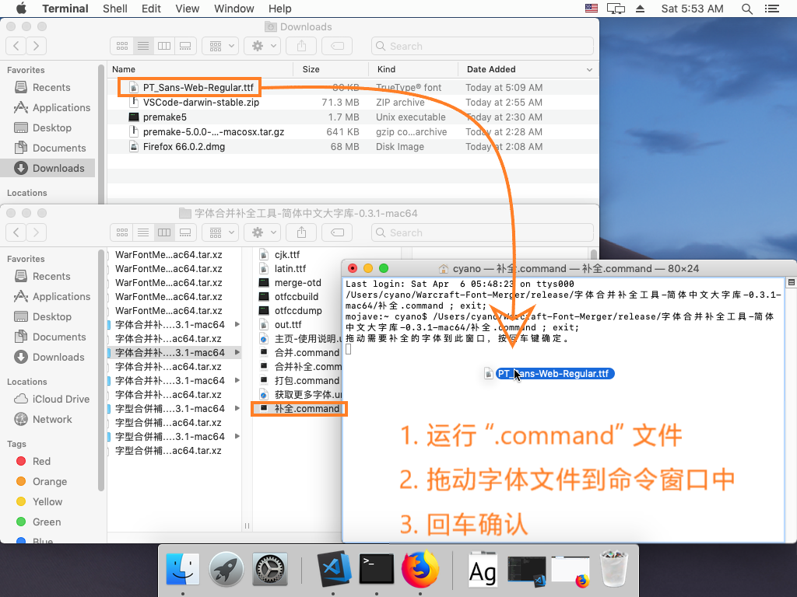

# Warcraft Font Merger aka “WFM”<br>(Warcraftのフォント統合&補完ツール)

## ダウンロード

こちらの[最新版](https://github.com/CyanoHao/Warcraft-Font-Merger/releases/latest)をダウンロードし、解凍をしてください。

フォントの統合と補完ツールは、異なるバージョンをランタイムプラットフォームとCAPTIVEフォントの2つに分割を行ないます。`WarFontMerger-自己完結型フォント-バージョン番号-ランニングプラットフォーム`。

WFMは以下の64bitオペレーティングプラットフォームをサポートしています :

| ランニングプラットフォーム | ランタイム | 備考 |
| -------- | ---------- | ---- |
| `windows-x64` — Windows x64 | なし（`msvcrt.dll`のリンク先）| Intel、AMD、メガコアプロセッサ |
| `windows-arm64` — Windows ARM64 | なし(`ucrtbase.dll`のリンク先）| Qualcomm、Microsoft SQ<i>x</i>、その他の ARMv8 プロセッサ |
| `mac` — macOS | macOS 10.15 またはそれ以降 | 汎用バイナリファイル |
| `linux-amd64` — Linux x86-64 | なし(musl 静的リンク)| その他の64bitアーキテクチャについては「コンパイルと実行」のセクションを参照 |

WFM には以下の自己完結型のフォントバージョンがあります：

| 自己完結型フォント | 文字セット | 備考 |
| -------- | ------ | ---- |
| `XS` — 圧縮フォント | GBK + 韓国語のハングル文字 | 圧縮技術を使用したフォント |
| `SC` — 簡体中国語 | GB18030 + 韓国語のハングル文字 | **推奨** |
| `CL` — 伝統的なグリフ | GB18030 + 韓国語のハングル文字 | 従来のタイポグラフィに近いフォントを使用 |

## クイックスタート（Windows）

### 2種類のフォントを統合して完成

WFMフォルダーを開いて統合をしたい2種類のフォントを `Merge and Complement.bat` にドラッグ&ドロップでしばらく待つと `out.ttf`としてフォントが生成されます。

操作説明図：


統合完了後の[フォントプレビュー](image/merge-out.png)、[英語](image/latin.png)と[中国語](image/cjk.png)の欠落がありません。

注：
1. 2つのフォントのみを統合する場合は `Maege.bat` に2種類のフォントをドラッグ&ドロップしてください。
2. フォントの補完は `latin.ttf` (英文) と `cjk.ttf` (日中韓) のフォントを使用して補完を行ないます。上の図では、2つのフォントを元のスタイルのフォントに合うように置き換えます。
3. 統合後からフォントを完成させるのと一度に統合を行なってフォントを完成させるのでは、効果が異なります。一度に統合をして完成をさせた場合の優先順位は「1番目のフォント」「`latin.ttf`」「2番目のフォント」「`cjk.ttf`」になります。先に統合を行ない、完成をさせた場合は「1番目のフォント」「2番目のフォント」「`latin.ttf`」「`cjk.ttf`」の順番になります。

### 欠落した文字を補完させる

WFMのフォルダーを開き`Complement.bat` を実行し`out.ttf`のフォントが生成されるまで待ちます。

### フォントパッケージの生成

WFMのフォルダーを開き `Packing.bat` を実行して作成をした `Fonts` フォルダーを `World of Warcraft\_retail_\` の下に移動します。

## クイックスタート（macOS と Linux）

### 未署名のWFMをmacOS上で実行可能にする

最新のmacOSでは、署名がされていないアプリケーションはデフォルトで実行ができません。このような状況に遭遇した場合は、以下のプログラムを手動で実行してみてください：
* `merge-otd`，
* `otfccdump`，
* `otfccbuild`，
* 実行をしたいコマンドファイル（`Complement.command`、`Merge and Complement.command`、`Merge.command`、`Packing.command`）。

具体的な説明：Control キーを押しながら、実行をしたいプログラムをクリックし、ポップアップメニューから「開く」を選択 (この時にパラメータエラーによりプログラムの実行に失敗しますが無視してください) その後にプログラムウィンドウを閉じます。

[開発元が未確認のMacアプリケーションを開く](https://support.apple.com/ja-jp/guide/mac-help/mh40616/mac)をご参照ください。

### 使い方

macOS と Linux の使い方は Windows とは少し異なります。

まずは適切な `.command` (macOS) または `.sh` (Linux) ファイルを開き、プロンプトに従って順番にフォントファイルをコマンドウィンドウにドラッグをして、Enter キーを押して確定します。

完成したフォントの`out.ttf`が出力されるまでしばらく待ちます。

動作中の図：



## 特徴

* 軽量：3つの実行ファイルで合計2MB強程、フォントを含む圧縮パッケージは10MB以下です。
* 多機能：フォントの統合以外にも欠落をしたフォントの補完にも使用する事ができます。
* 高速：中国語と英語のフォントを組み合わせてもかかる時間は、わずか20秒程。

## 制限事項

* コンパイル済みの32bit版はありません。
  * WFM のメモリ要件は、32bit の OS の環境では満たす事ができません。
  * 64bit の OS 上で 32bit の WFM を実行すると単一プロセスのメモリ制限である 4GiB を簡単に越えてしまいます。
  * Windows ARM64 では、WFM をネイティブとして実行ができるようになったので 32bit 版を必要としなくなりました
  * Windows x86 用のパッケージスクリプトはまだ利用可能ですが、後に廃止を検討しています。
* マルチスレッドは、現時点ではサポートしていません。
  * OTCFCC は元々、マルチタスクによってマルチコアプロセッサを最大限に活用するための開発ツールとして開発をした物です。
  * 将来的には徐々に様々なサポートをしていく予定ですが、明確なスケジュールが定まっていません。

## コンパイルと実行

### コンパイル

```bash
cmake . -B build/ -DCMAKE_BUILD_TYPE="Release"
cmake --build build/ -j<N>
```

もしも修正版を配布する場合は、 [package/](package/) にあるドキュメントと関連スクリプトを参照してください。

### 実行

2つのフォントを統合：
```bash
export PATH="$PWD/build:$PATH"
otfccdump 西文字体.ttf -o base.otd
otfccdump 中文字体.ttf -o cjk.otd
merge-otd base.otd cjk.otd
otfccbuild base.otd -O2 -o 合并之后的字体.ttf
rm *.otd
```

統合時はフォント名を指定する事もできます (パラメータの説明は`merge-otd`を直接実行してください) :
```bash
export PATH="$PWD/build:$PATH"
otfccdump 西文字体.ttf -o base.otd
otfccdump 中文字体.ttf -o cjk.otd
merge-otd -n "我的字体;Bold;Extended;Italic" base.otd cjk.otd
otfccbuild base.otd -O2 -o 合并之后的字体.ttf
rm *.otd
```

文字が欠落しているフォントを補完する：
```bash
export PATH="$PWD/build:$PATH"
otfccdump 需要补全的字体.ttf -o base.otd
otfccdump 收字很全的西文字体.ttf -o latin.otd
otfccdump 收字很全的中文字体.ttf -o cjk.otd
merge-otd base.otd latin.otd cjk.otd
otfccbuild base.otd -O2 -o 补全之后的字体.ttf
rm *.otd
```

統合されるフォントファイルの数は、原理的に基本的な制約によって制限がされます (コマンドライン引数、メモリ、OpenTypeキャラクタの数など) :
```bash
export PATH="$PWD/build:$PATH"
otfccdump 基本拉丁字母.ttf -o base.otd
otfccdump 扩展拉丁字母.ttf -o 1.otd
otfccdump 希腊字母.ttf     -o 2.otd
otfccdump 西里尔字母.ttf   -o 3.otd
otfccdump 假名.ttf         -o 4.otd
otfccdump 基本汉字.ttf     -o 5.otd
otfccdump 扩展汉字.ttf     -o 6.otd
otfccdump 谚文.ttf         -o 7.otd
otfccdump 其他CJK符号.ttf  -o 8.otd
merge-otd base.otd 1.otd 2.otd 3.otd 4.otd 5.otd 6.otd 7.otd 8.otd
otfccbuild base.otd -O2 -o 合并之后的字体.ttf
rm *.otd
```

## 謝辞

このプロジェクトでOpenTypeフォントファイルの解析と生成にしようされているotfccプログラムは以下になります。
[caryll/otfcc](https://github.com/caryll/otfcc)

[Niels Lohmann](https://github.com/nlohmann) 氏の [json](https://github.com/nlohmann/json) ライブラリは、非常に優れたC++JSONインターフェースを提供してくれました。このプロジェクトでは、文字の非標準エンコーディングを可能にする`json.hpp`の修正版を使用しています。

TrueType と PostScript の曲線アルゴリズムは [AFDKO](https://github.com/adobe-type-tools/afdko) と [Fontello](https://github.com/fontello/cubic2quad)に由来し、[otfcc で使うための別バージョン](https://github.com/nowar-fonts/otfcc-quad2cubic)があります。OpenType/TTとOpenType/CFFフォントの変換にそれぞれ使用できます。

Google は数多くのオープンソースフォントを提供し、Adobeは[思源黑体](https://github.com/adobe-fonts/source-han-sans)フォントを提供しています。

このプロジェクトでは、[Boost.Nowide](https://github.com/boostorg/nowide)と[clipp](https://github.com/muellan/clipp) を使用し、クロスプラットフォームのコマンドラインエクスペリエンスを提供しています。
